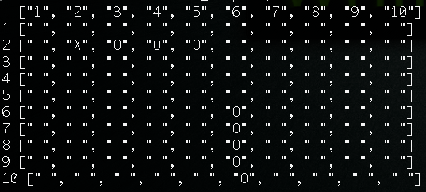

INSTRUCTIONS:

In the command line

CREATE A PLAYER = player1 = Player.new

CREATE SHIPS = ship = Ship.new(row, columm, length)

PLACING A SHIP HORIZONTALY = player1.board.place_horizontal(ship)

PLACING A SHIP VERTICALY = player1.board.place_vertical(ship)

ATTACK = p1.board.fire_at(row,columm)

SEE PLAYER BOARD = print palyer1.board.see_board

